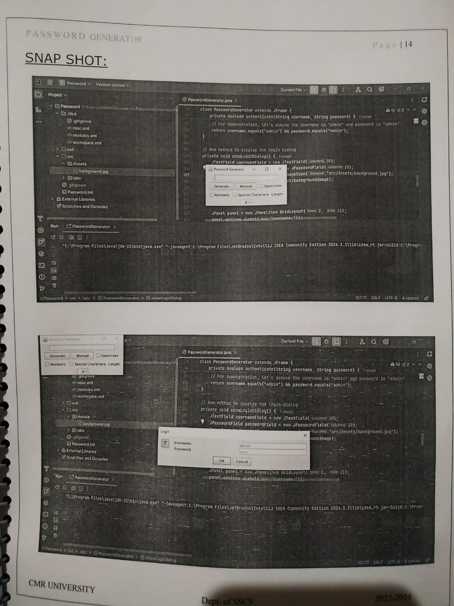

# 🔐 GUI Password Generator

A simple Java-based desktop application that generates secure passwords using a graphical interface. Built using **Java Swing**, this tool allows users to generate random passwords at the click of a button.

---

## 💡 Overview

This mini project was developed using **Java** in **Eclipse IDE**. The design follows **Object-Oriented Programming** principles and demonstrates basic GUI development. Perfect for learners experimenting with Java and Swing components.

---

## 🛠 Tech Stack

- ☕ Java  
- 🖥 Java Swing (GUI Toolkit)  
- 💻 Eclipse IDE  
- 📐 OOPS Concepts

---

## 📄 Code

The complete source code is available in this repo as a `pwdg.java.java` file.  

---

## 🖼 Screenshot

---

## 🌐 Live Demo

🚫 *This is a local desktop application — it does not have a hosted link.*

---

## 👩‍💻 Author

**Sharon Michelle Thomas**  
BCA Student | Software Engineer (Product-Minded)  

- GitHub: [@Michelleusesgit](https://github.com/Michelleusesgit)  
- LinkedIn: [linkedin.com/in/sharon-michelle](https://linkedin.com/in/sharon-michelle)
